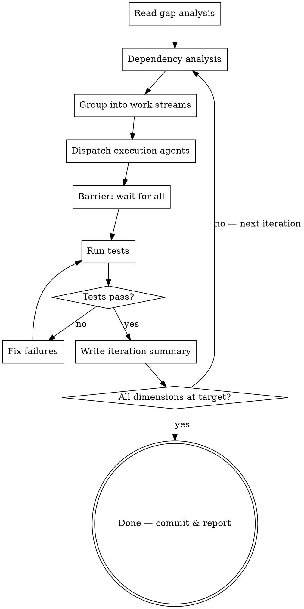

# vibe-gap-closure-loop

Autonomous loop that closes gap analysis findings to a target score. Dispatches parallel agents per work stream, runs test gates, re-audits, and repeats. Designed for YOLO mode — no confirmation between phases.

## When to Use This Skill
- After running `vibe-gap-analysis` and receiving a gap report
- When you have 10+ findings to close systematically
- When findings span multiple system areas that can be parallelized
- Production readiness sprints

## When NOT to Use This Skill
- Fewer than 5 findings (just fix them directly)
- Findings that require architectural redesign (needs `vibe-research-before-design` first)
- When you don't have a gap analysis document yet (run `vibe-gap-analysis` first)

## Arguments

```
/vibe-gap-closure-loop [dimensions] [--target N] [--gap-file PATH]
```

- `dimensions`: Which dimensions to close (default: `1-12`)
- `--target`: Target score per dimension (default: `95`)
- `--gap-file`: Path to gap analysis (default: latest `gap-analysis-*.md`)

## Loop Flow



## Step 1: Dependency Analysis

Read the gap analysis document. For each finding in target dimensions, build a dependency graph:

**Dependency rules:**
- Security findings block everything — fix first
- Schema/migration changes block feature work that touches those tables
- A finding that says "Add X to Y" depends on Y existing
- Test infrastructure changes block test-dependent findings
- Frontend findings are independent of backend findings (parallel)
- Trivial fixes (< 30min) have no dependencies — batch them

**Output:** Ordered list of work streams with dependencies between streams.

## Step 2: Group into Work Streams

Group findings into **max 5 parallel streams** per iteration:
- 3-7 related findings per stream (same system area or dependency chain)
- No dependencies between streams in the same iteration
- Sized for one agent session (< 2 hours of work)

**Example grouping:**
```
Stream 1: Security (C-1, C-2, C-3, H-1, H-2)
Stream 2: Reliability (C-5, C-6, H-5, H-6, H-7)
Stream 3: Ops & Config (C-8, H-11, H-15, M-1)
Stream 4: Cost & Observability (H-8, H-9, C-14, C-15)
Stream 5: Completeness (remaining findings)
```

Defer any stream that depends on another stream's output to the next iteration.

## Step 3: Dispatch Execution Agents

For EACH stream, dispatch a subagent (model: sonnet) using the Agent tool:

```
You are closing production readiness gaps for [project].

**Your stream:** [Stream name]
**Findings to close:** [Finding IDs with full descriptions from gap analysis]

For each finding:
1. Read the relevant source files
2. Implement the fix described in the gap analysis
3. Add tests for the fix
4. Verify with the project's test command

After completing all steps:
- Run tests to verify no regressions
- Commit with: fix([area]): close [finding IDs]
- Do NOT commit if tests fail

Return: list of findings closed + any that could not be closed with reason.
```

All agents dispatch in parallel. Wait for all to complete.

## Step 4: Test Gate

After all agents return:
1. Run the full test suite
2. If failures: fix directly (likely merge conflicts between streams)
3. Run linters
4. Commit any remaining fixes

## Step 5: Iteration Summary

Write `docs/plans/closure/iteration-N-summary.md` with:
- Table of streams, findings closed, commit hashes
- Cumulative progress (running total across iterations)
- Remaining open findings
- Test results

## Step 6: Check Target

Compare progress against target:
- If all target dimensions have their findings closed: **DONE**
- If not: extract remaining open findings, go back to Step 1

## Iteration Limits

- **Max iterations**: 5 per invocation (prevent infinite loops)
- **Max agents per iteration**: 5 streams (prevent resource explosion)
- **Max findings per stream**: 7 (keep agent context focused)
- **Escalation**: If a finding fails to close after 2 iterations, flag for human review

## Conflict Resolution

When two agents edit the same file:
- The second agent's commit may have conflicts
- Resolve by reading both changes and merging manually
- Run tests after resolution

To minimize conflicts, step 2 (grouping) should avoid placing findings that touch the same files in different streams.

## Output

Each iteration produces:
- `docs/plans/closure/iteration-N-summary.md` — what closed, what remains
- Git commits per stream with finding IDs in message

Final output: comprehensive closure status document with all findings accounted for.
