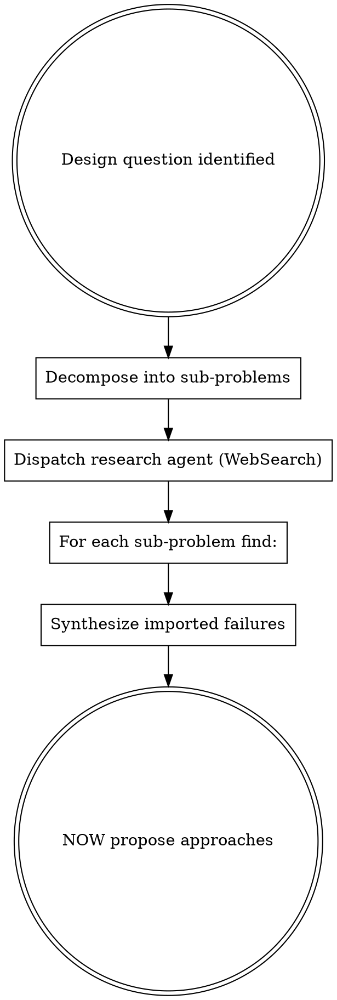

# vibe-start-informed

Other people's documented failures count as observed failure. Research SOTA before proposing anything.

## When to Use

- Brainstorming new features or capabilities
- Designing architecture for a new sub-system
- Choosing between technology approaches
- Any creative/design task where multiple valid approaches exist

**Not for:** Implementing already-designed specs, bug fixes, or tasks with clear requirements.

## The Rule

**BEFORE proposing any approach, dispatch a research agent** to find real papers, real projects, and real production systems that solve the same (or adjacent) problem.

## Research Requirements

For each sub-problem, find:

| Requirement | Minimum | Example |
|-------------|---------|---------|
| Named projects | 2+ with stars/adoption | "Graphiti (23k stars)" |
| Papers with venue | 1+ with year | "RAPTOR (ICLR 2024)" |
| Mechanism described | What it actually does | Not marketing copy |
| Known failures | What went wrong | "Flat RAG failed at multi-hop" |
| Applicability assessment | How it maps to our system | Specific, not generic |

## Red Flags

| Thought | Reality |
|---------|---------|
| "I already know the best approach" | You know ONE approach. Research finds others. |
| "This is too niche for research" | If someone built it, someone documented failures. |
| "Research will slow us down" | Uninformed design causes rewrites. Research prevents them. |
| "The textbook answer is obvious" | JK: "These are very very weak suggestions." Do real research. |
| "Let me just propose something" | Proposals without research are guesses with confidence. |

## Origin

Alien Chang-Unni Constitution v0.1, Law 5 (amended in Session 2):

> **Start Informed** — leverage SOTA research as collective observed failure. Simplify only when observed complexity causes problems in practice. Other people's documented failures count as observed failure.

The amendment was triggered when a constitutional audit revealed every design decision violated the original "Start Stupid" law. The law was changed because importing proven approaches isn't premature complexity — it's standing on shoulders.
